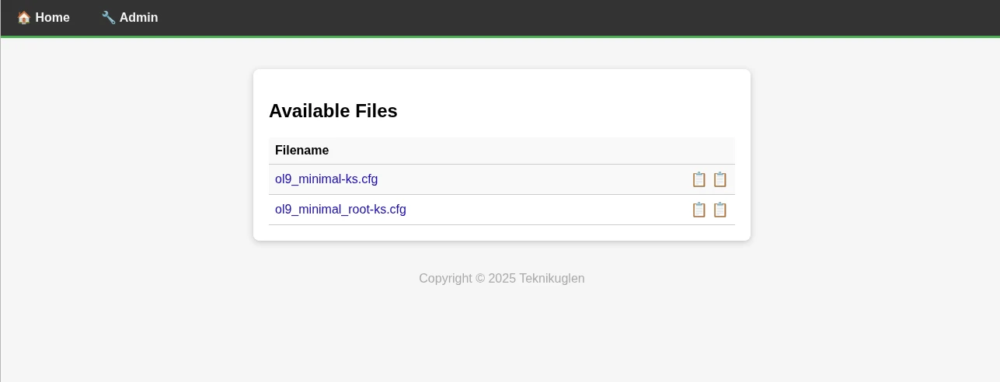
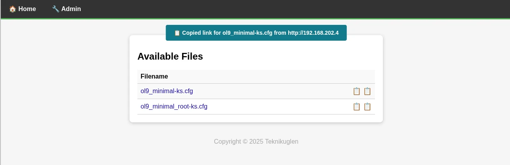
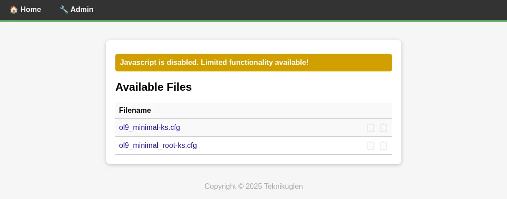
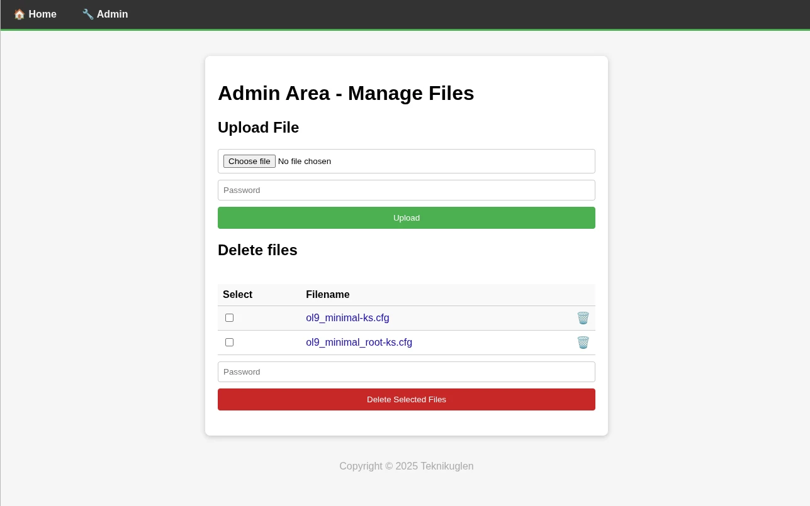
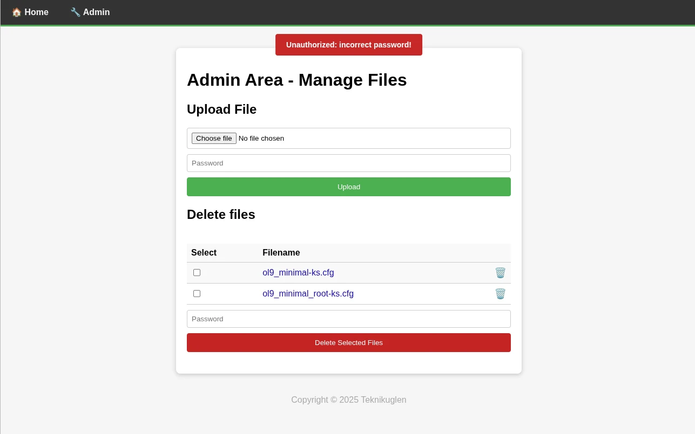

# EzFileServe

Simple web file upload and server for local file retrieval, made to e.g. serve
kickstart files for (semi) automatic OS installations of RedHat based distros.

It has the following features:

- Password authentication can be disabled on either admin or upload, or both.
    - The upload password is for the upload section on the admin page.
    - The admin password is for the delete section on the admin page.
- Admin page can be disabled completely.
- Multiple download links can be configured by listing server addresses in the env file.
- The footer year can be configured, and will cause a from/to message if the year listed is not the same as current year.
- The upload folder can be defined and can be either a relative or absolute path.
- Limited functionality is still available with javascript disabled.

> ⚠️ The server is NOT meant to be accessible from the Internet.

## Configuration

Currently the configuration just resides in the `.env` file. This includes the
passwords.

See the `env.example` file for details.

## run with gunicorn

manually run

```sh
gunicorn -w 4 -b 0.0.0.0:8000 app:app
```

scripted run

```sh
./start_server.sh
```

## systemd service

The script `service_install.sh` will create a systemd service file, which will
handle starting and stopping the gunicorn app.

It uses the `start_server.sh` script to actually launch the app.

## pytest

The app should be editable, which can be done using

```sh
pip install -e .[dev]
```

Then pytest can be run as 

```sh
pytest -sv
```

## Screenshots










